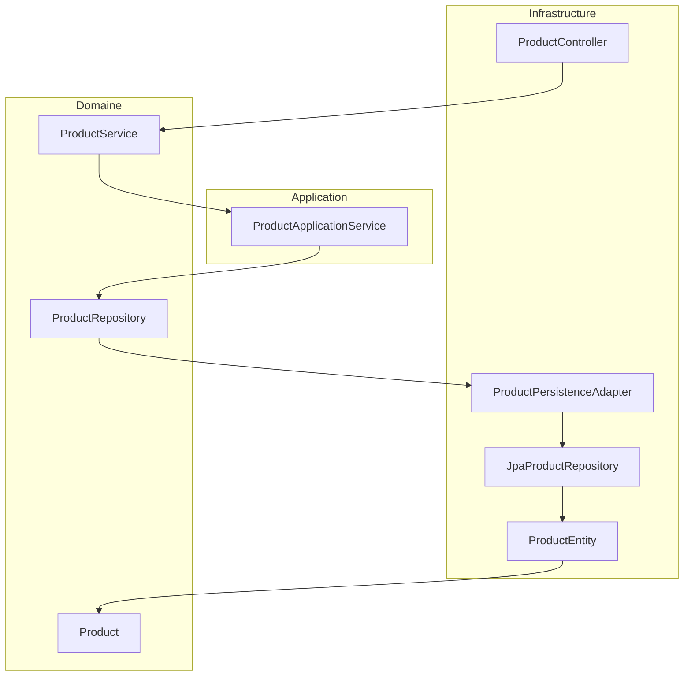

src/main/java/com/hexagonal/demo/

# Guide de Démarrage Hexagonal - Adapté au Codebase

## Introduction

Ce guide présente la structure réelle du projet, les flux entre modules, et les bonnes pratiques pour développer et maintenir une application hexagonale multi-modules avec Spring Boot.

---

## 1. Structure Multi-modules

Le projet est organisé en 4 modules Maven :

- **hexagonal-domain**
  - `model/` : Entités métier (ex : `Product.java`)
  - `ports/api/` : Ports d'entrée (ex : `ProductService.java`)
  - `ports/spi/` : Ports de sortie (ex : `ProductRepository.java`)
  - `service/` : Logique métier (optionnel)
- **hexagonal-application**
  - `service/` : Services applicatifs (ex : `ProductApplicationService.java`)
- **hexagonal-infrastructure**
  - `adapters/input/rest/` : Contrôleurs REST (ex : `ProductController.java`)
  - `adapters/output/persistence/` : Adapter de persistance (ex : `ProductPersistenceAdapter.java`)
  - `adapters/output/persistence/entity/` : Entités JPA (ex : `ProductEntity.java`)
  - `adapters/output/persistence/mapper/` : Mapper MapStruct (ex : `ProductMapper.java`)
  - `adapters/output/persistence/repository/` : Repository JPA (ex : `JpaProductRepository.java`)
  - `config/` : Config technique (ex : `OpenApiConfig.java`)
- **hexagonal-boot**
  - `HexagonalApplication.java` : Classe main Spring Boot

Chaque module possède son propre dossier `src` et son `pom.xml`.

---

## 2. Flux d’appel entre modules



---

## 3. Ordre de développement

1. **Commencer par le domaine** : définir les entités, les ports (API/SPI), la logique métier
2. **Créer le module application** : implémenter les services applicatifs qui orchestrent les cas d’usage
3. **Développer l’infrastructure** : créer les adapters REST, persistance, mapper, repository, config technique
4. **Finaliser avec le boot** : assembler et démarrer l’application

---

## 4. Exemple de cycle d’appel (Product)

1. L’utilisateur appelle l’API REST `/api/products` (`ProductController`)
2. Le controller utilise le port API `ProductService` (domaine)
3. L’implémentation réelle est `ProductApplicationService` (application)
4. Ce service utilise le port SPI `ProductRepository` (domaine)
5. L’implémentation réelle est `ProductPersistenceAdapter` (infrastructure)
6. L’adapter utilise `JpaProductRepository` pour accéder à la base via l’entité `ProductEntity`

---

## 5. Bonnes pratiques et conseils

- Ne jamais mettre de dépendances techniques dans le domaine ou l’application
- Les tests unitaires du métier se font sur le domaine et l’application
- Les tests d’intégration se font sur l’infrastructure
- Les beans Spring sont déclarés uniquement dans l’infrastructure et le boot

---

## 6. Ajouter une nouvelle fonctionnalité (exemple)

### a) Domaine (hexagonal-domain)

Créer l’entité métier :

```java
@Data
@Builder
@NoArgsConstructor
@AllArgsConstructor
public class Product {
    private Long id;
    private String name;
    private String description;
    private BigDecimal price;
    private Integer quantity;
}
```

Définir les ports :

```java
public interface ProductService {
    Product createProduct(Product product);
    Optional<Product> getProduct(Long id);
    List<Product> getAllProducts();
    Product updateProduct(Product product);
    void deleteProduct(Long id);
}

public interface ProductRepository {
    Product save(Product product);
    Optional<Product> findById(Long id);
    List<Product> findAll();
    void deleteById(Long id);
}
```

### b) Application (hexagonal-application)

Implémenter le service applicatif :

```java
public class ProductApplicationService implements ProductService {
    private final ProductRepository productRepository;
    // ...constructeur et méthodes
}
```

### c) Infrastructure (hexagonal-infrastructure)

Adapter de persistance :

```java
@Component
@RequiredArgsConstructor
public class ProductPersistenceAdapter implements ProductRepository {
    private final JpaProductRepository jpaProductRepository;
    private final ProductMapper productMapper;
    // ...implémentation
}
```

Contrôleur REST :

```java
@RestController
@RequestMapping("/api/products")
@RequiredArgsConstructor
public class ProductController {
    private final ProductService productService;
    // ...endpoints
}
```

### d) Boot (hexagonal-boot)

Classe main :

```java
@SpringBootApplication
public class HexagonalApplication {
    public static void main(String[] args) {
        SpringApplication.run(HexagonalApplication.class, args);
    }
}
```

---

## 7. Qualité et outils

- **Checkstyle** : vérification du style de code (`checkstyle.xml`)
- **Tests** : unitaires sur le domaine/application, intégration sur l’infrastructure
- **Documentation** : Swagger/OpenAPI
- **Sécurité** : API Key via header `X-API-KEY`

---

## 8. Checklist de développement

- [ ] Modèle de domaine créé et validé
- [ ] Ports définis (API et SPI)
- [ ] Service applicatif implémenté
- [ ] Adapter de persistance et REST créés
- [ ] Migration Liquibase ajoutée
- [ ] Tests unitaires et d’intégration écrits
- [ ] Documentation mise à jour

---

## 9. Ressources utiles

- [Architecture Hexagonale](https://alistair.cockburn.us/hexagonal-architecture/)
- [Spring Boot Documentation](https://docs.spring.io/spring-boot/docs/current/reference/html/)
- [MapStruct Documentation](https://mapstruct.org/documentation/stable/reference/html/)
